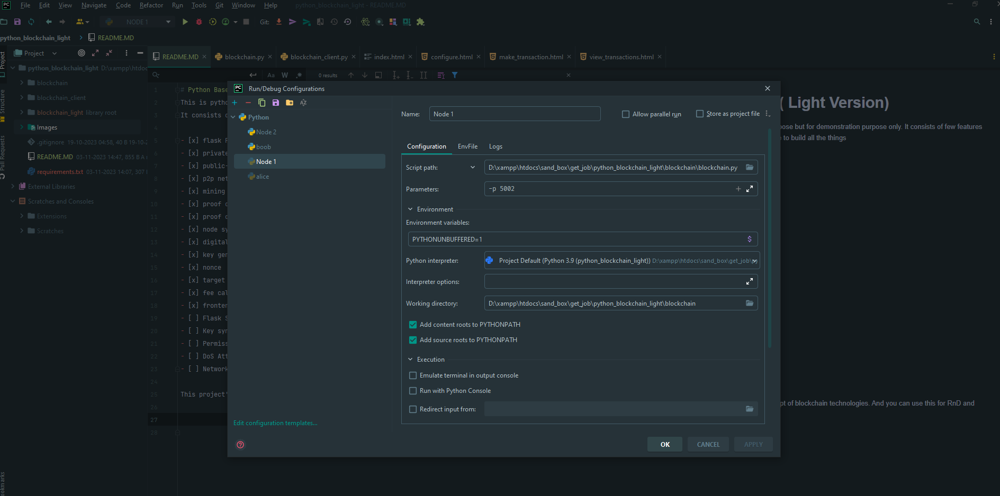
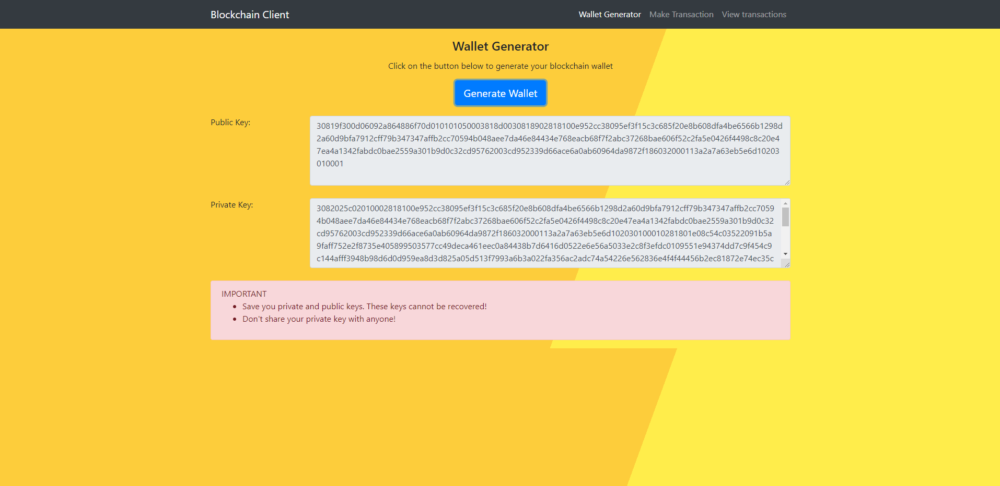
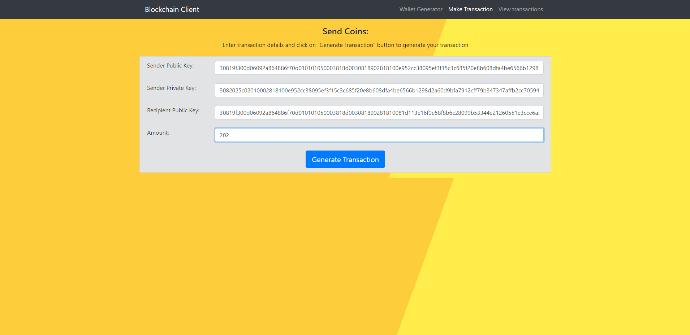
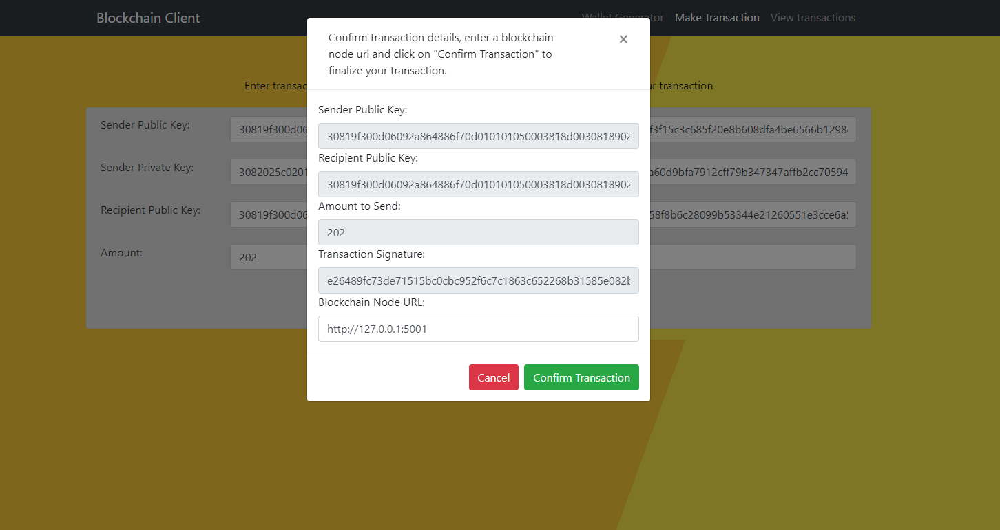
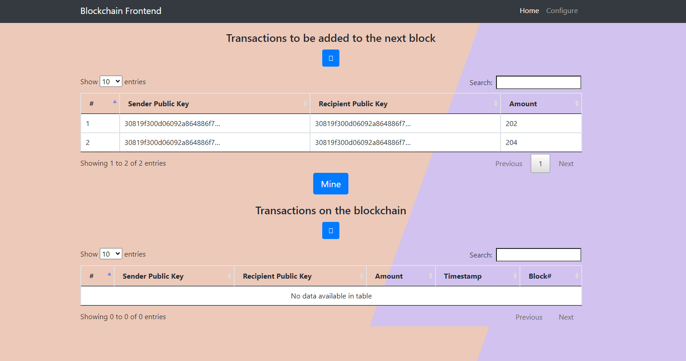
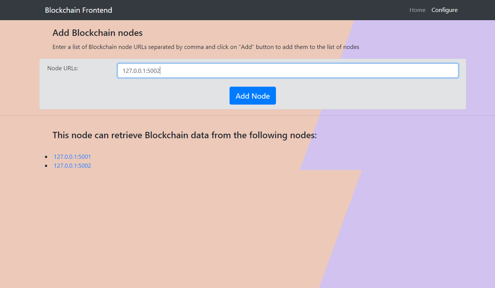
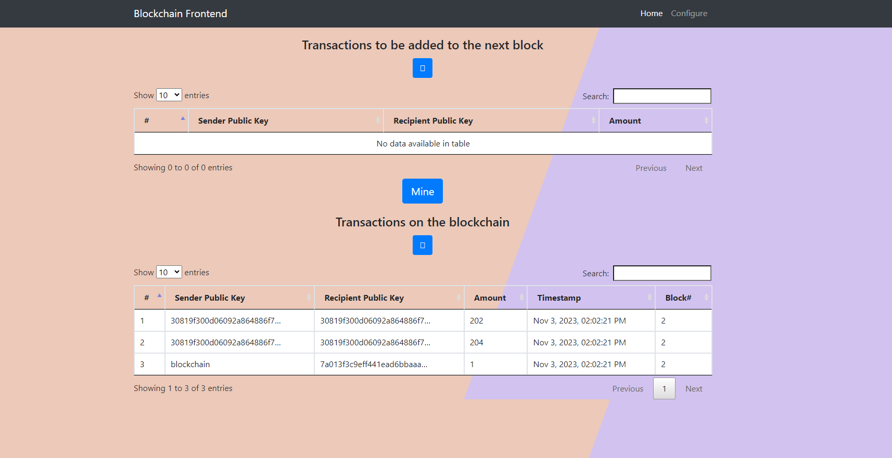

# Python Based Blockchain ( Light Version)
This is python based blockchain project, not for production purpose but for demonstration purpose only. 
It consists of few features and few features are pending, I will be working on this on future to build all the things

- [x] flask Framework
- [x] private-key-encryption
- [x] public-key-encryption
- [x] p2p network
- [x] mining
- [x] proof of stake
- [x] proof of work
- [x] node synchronization
- [x] digital signature
- [x] key generate
- [x] nonce
- [x] target difficulty
- [x] fee calculation
- [x] frontend
- [ ] Flask Security
- [ ] Key synchronization
- [ ] Permission and Access Control
- [ ] DoS Attacks
- [ ] Network Security

This project's purpose is learning and understanding the concept of blockchain technologies. And you can use this for RnD and demo purpose.

Configur in PyCharm IDE to run multiple Nodes. A screenshot is given belo 

**How the projects Works, a demo is given below:**

1. Generate your keys

2. Use the keys to send coins

3. Use the model to chose network

4. Go to the node and view the pending transactions

5. You can configure i.e. can add new nodes

6. Can mine the nodes and also synchronize the nodes

*I am not very good at frontend designing guys, so pardon my color test*

